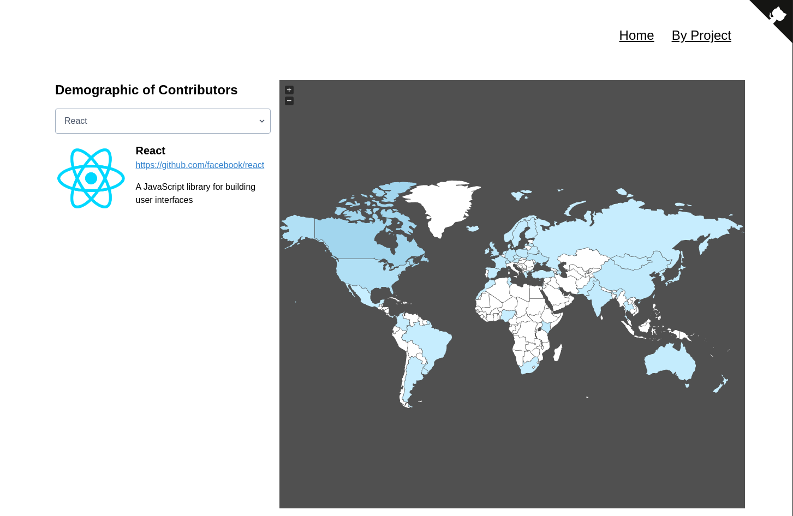

<!-- PROJECT LOGO -->
 

  

  

  Demographic visualization of OpenSource Projects.
     
    <a href="https://sunitdeshpande.github.io/DevGeo/#/">View Demo</a>
    ·
    <a href="https://github.com/sunitdeshpande/DevGeo/issues">Report Bug</a>
    ·
    <a href="https://github.com/sunitdeshpande/DevGeo/issues">Request Feature</a>
  

<!-- ABOUT THE PROJECT -->
## About The Project

**DevGeo** is visualization of demographics of contributors associated with differeent Open Source projects.

### Built With
Following Frameworks, Libraries and tools are used in building this app.
* [VueJs](https://vuejs.org/)
* [TailwindCSS](https://tailwindcss.com/)
* [Python3](https://www.python.org/)
* [Storybook](https://storybook.js.org/)
* [Pytest](https://docs.pytest.org/en/latest/)
* [Jest](https://docs.pytest.org/en/latest/)

## Contact

Sunit Deshpande - sunitdeshpande1234@gmail.com

Project Link: [https://github.com/sunitdeshpande/DevGeo](https://github.com/sunitdeshpande/DevGeo)

